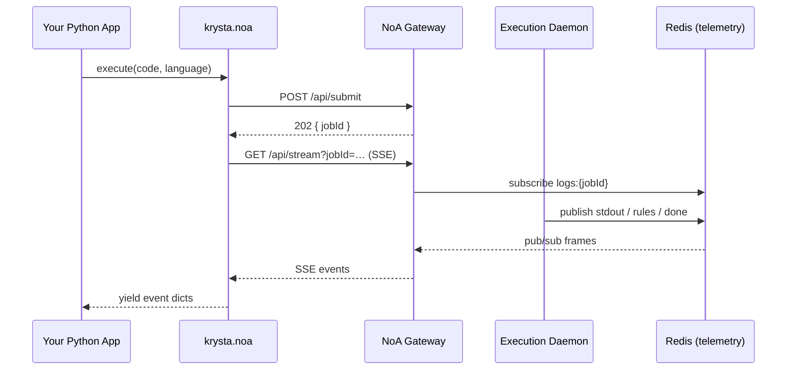

# Krysta NoA — Python SDK

**Execute AI-agent code safely.** Krysta NoA runs untrusted Python and JavaScript inside an isolated sandbox with no network access, memory limits, and live streaming telemetry. Built for agent loops, eval harnesses, and production guardrails.

```bash
pip install krysta
```

---

## Table of contents

1. [What you get](#what-you-get)
2. [Architecture](#architecture)
3. [Installation](#installation)
4. [Quick start](#quick-start)
5. [Configuration](#configuration)
6. [API reference](#api-reference)
7. [Streaming events](#streaming-events)
8. [Safety rules](#safety-rules)
9. [Agent workflows](#agent-workflows)
10. [Error handling](#error-handling)
11. [Self-hosted gateway](#self-hosted-gateway)
12. [Validate production](#validate-production)
13. [Troubleshooting](#troubleshooting)
14. [PyPI](#pypi)

---

## What you get

| Capability | Description |
|---|---|
| **Sandboxed execution** | Python 3.11 or Node 20 in Docker — no network, 128 MB RAM cap, read-only FS |
| **Live SSE streaming** | `stdout`, `stderr`, rules, and lifecycle events in real time |
| **Dual execution modes** | Stream with `async for`, or `await` for a resolved `ExecutionTrace` |
| **Stateful sessions** | `spawn()` mounts a persistent `/workspace` for multi-turn agent loops |
| **`test_agent()`** | Run expression-based test cases against a local agent file |
| **Client-side validation** | `RuleEngine` + `ExecutionTrace` for offline rule checks |

---

## Architecture



**Data flow**

1. Your app submits code → gateway returns a `jobId`.
2. SDK opens an SSE stream on `/api/stream`.
3. The daemon runs code in Docker and publishes events to Redis.
4. Gateway forwards events; SDK yields them (batched `stdout` is expanded automatically).

---

## Installation

```bash
pip install krysta
```

**Optional** — for `ExecutionTrace.from_redis()` (post-run inspection via Upstash):

```bash
pip install upstash-redis python-dotenv
```

Create `.env.local` in your project root:

```env
UPSTASH_REDIS_REST_URL=https://….upstash.io
UPSTASH_REDIS_REST_TOKEN=AX….
```

---

## Quick start

### Stream events live

```python
import asyncio
from krysta.noa import Noa

async def main():
    async with Noa() as client:
        async for event in client.execute(
            language="python",
            code='import json\nprint(json.dumps({"status": "ok"}))',
        ):
            if event["type"] == "stdout":
                print("OUT:", event["text"])
            elif event["type"] == "done":
                print("Finished.")

asyncio.run(main())
```

### Await a full trace

```python
import asyncio
from krysta.noa import Noa

async def main():
    async with Noa() as client:
        trace = await client.execute(
            language="python",
            code="print('hello')",
        )
        print(trace.job_id)
        print(trace.duration_ms)
        print(trace.stdout_lines)

asyncio.run(main())
```

### Run from a file

```python
trace = await client.execute(language="python", code_path="agent_output.py")
```

Max payload size: **256 KB**.

---

## Configuration

| Variable | Purpose | Default |
|---|---|---|
| `KRYSTA_GATEWAY_URL` | Gateway base URL (used by test suite) | `http://localhost:3000` |
| `UPSTASH_REDIS_REST_URL` | Redis REST URL for `ExecutionTrace.from_redis` | — |
| `UPSTASH_REDIS_REST_TOKEN` | Redis REST token | — |

**Hosted gateway (default):** `https://app.krystawing.com`

**Local dev:** run [kwing_noa](https://github.com/Krysta-Wing/) and point the SDK at it:

```python
async with Noa(gateway_url="http://localhost:3000") as client:
    ...
```

---

## API reference

### Package exports

```python
from krysta import (
    Noa,
    spawn,
    Sandbox,
    ExecutionTrace,
    RuleEngine,
    KrystaError,
    KrystaTimeoutError,
    KrystaGatewayError,
    KrystaSandboxError,
)
```

### `Noa(gateway_url=...)`

Main async client. **Must** be used as a context manager:

```python
async with Noa(gateway_url="https://app.krystawing.com") as client:
    ...
```

| Method | Description |
|---|---|
| `execute(...)` | Returns `ExecutionStream` — async-iterable and awaitable |
| `trace(job_id)` | Build `ExecutionTrace` (loads from Redis if configured) |
| `validate(trace)` | Run client-side `RuleEngine` on a trace |
| `test_agent(code_path, test_cases, ...)` | Batch-test functions in a file |

### `execute()` parameters

```python
client.execute(
    language="python",      # "python" | "javascript"
    code=None,              # source string
    code_path=None,         # or path to a file (max 256 KB)
    timeout_ms=10000,       # 1–60000 ms
    session_id=None,        # set for persistent /workspace
)
```

Either `code` or `code_path` is required.

### `spawn()` — stateful agent sessions

Use when an agent writes code, runs it, fixes it, and re-runs in the same workspace:

```python
import asyncio
from krysta.noa import spawn

async def main():
    async with spawn(runtime="python", session_id="agent-turn-1") as sandbox:
        # Write a file in /workspace
        async for e in sandbox.execute(code="open('/workspace/data.txt','w').write('hello')"):
            pass
        # Read it back on the next run
        async for e in sandbox.execute(code="print(open('/workspace/data.txt').read())"):
            if e["type"] == "stdout":
                print(e["text"])

asyncio.run(main())
```

- Without `session_id`, a random UUID is assigned.
- Filesystem access is **only** allowed inside `/workspace` when a session is active.
- Network remains blocked in all cases.

### `test_agent()`

Runs each test case as a Python expression against functions in a **dedicated agent file** (not the test runner itself):

```python
results = await client.test_agent(
    code_path="agent_fixtures.py",
    test_cases=[
        {"name": "normal", "input": "calculate_stats([1, 2, 3, 4, 5])"},
        {"name": "empty",  "input": "calculate_stats([])"},
        {"name": "bad",    "input": "calculate_stats('not a list')"},
    ],
    language="python",
    timeout_ms=5000,
)

for r in results:
    print(r["name"], r["status"], r.get("error"))
```

Each result includes: `name`, `status` (`pass` / `fail` / `error`), `stdout`, `stderr`, `error`, `rules`.

### `ExecutionTrace`

Resolved run summary (from awaitable `execute()` or `from_redis()`):

| Field | Type | Description |
|---|---|---|
| `job_id` | `str` | Infrastructure job identifier |
| `duration_ms` | `int` | Wall-clock execution time |
| `stdout_lines` | `list` | `[{type, text}, …]` |
| `exit_code` | `int \| None` | Process exit code |
| `timeout_hit` | `bool` | Whether the run timed out |

```python
trace = ExecutionTrace.from_redis("abc-123")  # requires Upstash env vars
report = client.validate(trace)
print(report["passed"], report["results"])
```

### `RuleEngine` (client-side)

Offline validation of a trace — useful for CI without hitting the gateway:

```python
from krysta import RuleEngine, ExecutionTrace

engine = RuleEngine()
trace = ExecutionTrace(job_id="local", stdout_lines=[{"type": "stdout", "text": '{"ok": true}'}], exit_code=0)
print(engine.validate(trace))
```

### `display.run_with_display()` (optional UX helper)

Pretty-prints stream output and rule results to the terminal:

```python
from krysta.display import run_with_display
from krysta.noa import spawn

async with spawn(runtime="python") as sandbox:
    result = await run_with_display(sandbox, code="print('hello')")
```

---

## Streaming events

Every `execute()` yields dicts:

```json
{"type": "system", "text": "EXECUTION_STARTED", "timestamp": 1710000000000}
{"type": "stdout", "text": "hello", "timestamp": 1710000000001}
{"type": "rules", "text": "[{...}]", "timestamp": 1710000000002}
{"type": "metrics", "text": "{\"duration_ms\": 45}", "timestamp": 1710000000003}
{"type": "done", "text": null, "timestamp": 1710000000004}
```

| `type` | When | Notes |
|---|---|---|
| `system` | Start | e.g. `EXECUTION_STARTED` |
| `stdout` | During run | One line per yield (batched server-side events are expanded by the SDK) |
| `stderr` | During run | Error output, tracebacks |
| `rules` | Near end | `text` is JSON list of rule results |
| `metrics` | Near end | `text` contains `duration_ms` |
| `done` | Success | Exit code 0 |
| `timeout` | Killed | Exceeded `timeout_ms` |
| `error` | Failure | Non-zero exit or infrastructure error |

**Handle all terminal types** before assuming success:

```python
async for event in client.execute(...):
    if event["type"] in ("done", "timeout", "error"):
        final = event["type"]
        break
```

---

## Safety rules

Returned in the `rules` event as JSON:

```json
[
  {"rule": "NoNetworkCallsRule", "result": "PASS", "reason": "...", "category": "security"},
  {"rule": "ExitCodeZeroRule", "result": "PASS", "reason": "...", "category": "security"},
  {"rule": "MemoryLimitRule", "result": "PASS", "reason": "...", "category": "security"},
  {"rule": "NoFilesystemAccessRule", "result": "PASS", "reason": "...", "category": "security"},
  {"rule": "ValidJsonRule", "result": "PASS", "reason": "...", "category": "optional"}
]
```

### Security rules (must all pass for a safe run)

| Rule | Checks |
|---|---|
| `NoNetworkCallsRule` | No outbound network calls or attempts |
| `ExitCodeZeroRule` | Clean exit (code 0) |
| `MemoryLimitRule` | Stayed under 128 MB container limit |
| `NoFilesystemAccessRule` | No FS access outside `/workspace` (or none without session) |

### Optional rules (informational)

| Rule | Checks |
|---|---|
| `ValidJsonRule` | Whether stdout is valid JSON |

**Static pre-checks** (before Docker runs): source containing `urllib`, `requests`, `fetch(`, etc. is rejected immediately. Same for filesystem patterns like `open(` when no `session_id` is set.

---

## Agent workflows

### Pattern 1 — generate, run, fix loop

```python
async def agent_loop(client, code: str) -> str:
    for attempt in range(3):
        stderr_lines = []
        async for event in client.execute(language="python", code=code, timeout_ms=15000):
            if event["type"] == "stderr":
                stderr_lines.append(event["text"])
            elif event["type"] == "done":
                return code
            elif event["type"] == "error":
                code = await your_llm_fix(code, stderr_lines)
                break
    raise RuntimeError("Agent failed after retries")
```

### Pattern 2 — JSON contract agents

Agents should print **one JSON document** on stdout for `ValidJsonRule` to pass:

```python
code = """
import json
result = {"answer": 42, "confidence": 0.99}
print(json.dumps(result))
"""
```

### Pattern 3 — multi-file session agent

```python
async with spawn(runtime="python", session_id="build-42") as sb:
    await sb.execute(code_path="setup.py")   # writes /workspace/...
    async for e in sb.execute(code_path="run.py"):
        ...
```

---

## Error handling

```python
from krysta.exceptions import KrystaGatewayError, KrystaTimeoutError, KrystaError

try:
    async with Noa() as client:
        trace = await client.execute(language="python", code="...")
except ValueError as e:
    # Missing code, or payload > 256 KB
    ...
except RuntimeError as e:
    # Used Noa without async with, or stream dropped before jobId
    ...
except KrystaGatewayError as e:
    # Bad gateway URL, 4xx/5xx, SSE failure
    ...
except KrystaTimeoutError as e:
    # SSE channel timed out (not the same as sandbox timeout event)
    ...
```

| Exception | Typical cause |
|---|---|
| `ValueError` | No `code`/`code_path`, or file too large |
| `RuntimeError` | Client not entered via `async with` |
| `KrystaGatewayError` | Gateway down, rejected submit, bad response |
| `KrystaTimeoutError` | HTTP/SSE transport timeout |
| `KrystaSandboxError` | Base class for sandbox-specific errors |

---

## Self-hosted gateway

Run the [kwing_noa](https://github.com/Krysta-Wing/) Next.js app + execution daemon locally:

```bash
# Terminal 1 — gateway
cd kwing_noa && npm run dev

# Terminal 2 — daemon
node src/infrastructure/noa-daemon.js
```

Point the SDK at it:

```python
async with Noa(gateway_url="http://localhost:3000") as client:
    ...
```

Required daemon env (`.env.local`): `REDIS_URL`, Kafka broker, `SANDBOX_MODE=docker`.

---

## Validate production

`agent_output.py` is the **full production test suite** — local module checks plus live gateway integration.

```bash
# Against local gateway (requires gateway + daemon)
export KRYSTA_GATEWAY_URL=http://localhost:3000
# Terminal 1: cd kwing_noa && npm run dev
# Terminal 2: cd kwing_noa && node src/infrastructure/noa-daemon.js
python agent_output.py

# Against hosted production
export KRYSTA_GATEWAY_URL=https://app.krystawing.com
python agent_output.py

# Local-only tests (no gateway required)
python agent_output.py --local-only
```

The suite covers:

- Package imports and exceptions
- `RuleEngine` / `ExecutionTrace` unit logic
- SDK input validation (missing code, size limits)
- Python & JavaScript execution
- Streaming vs awaitable modes
- `test_agent()` on `calculate_stats`
- Security rules (network, filesystem, timeout)
- Stateful `spawn()` sessions
- Concurrent jobs, multi-line stdout, `code_path`
- Optional Redis trace hydration

Exit code `0` = all required tests passed; `1` = failures.

---

## Troubleshooting

| Symptom | Fix |
|---|---|
| `KrystaGatewayError` on submit | Check `gateway_url`, ensure daemon + gateway are running |
| Empty stdout but `done` received | Rare race — upgrade SDK; stream replays from Redis on reconnect |
| `NoNetworkCallsRule` FAIL | Remove `requests`, `urllib`, `fetch`, etc. from agent code |
| `NoFilesystemAccessRule` FAIL | Use `spawn(session_id=...)` for file I/O; stay in `/workspace` |
| `ValidJsonRule` FAIL | Print exactly one JSON object/string on stdout |
| `Connection dropped before jobId` | Network blip during submit — retry execute |
| `Missing UPSTASH_REDIS_REST_URL` | Set env vars or skip trace tests with `--local-only` |
| SSE timeout | Increase sandbox `timeout_ms`; check Redis/Upstash quotas |

**Upstash free tier:** 500,000 commands/month. Check usage in the [Upstash Console](https://console.upstash.com/) → your database → **Usage**.

---

## PyPI

[https://pypi.org/project/krysta/](https://pypi.org/project/krysta/)

```bash
pip install krysta==1.0.9
```

---

## License

MIT — see repository for details.
