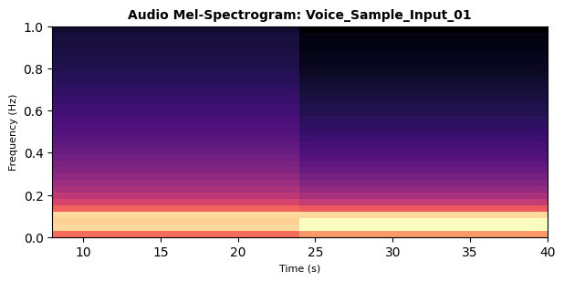

# KRYSTA WING // WEEKLY MODEL ANALYSIS REPORT

## [SYSTEM METADATA]
* **Target Model:** KWing-Whisper-Voice
* **Evaluation Week:** Week 21
* **Analysis Timestamp:** 2026-05-29 08:51:32
* **Modality Profile:** AUDIO

---

## [1. COMPUTE & PERFORMANCE BENCHMARKS]
| Metric | Observed Value | Status |
| :--- | :--- | :--- |
| **Inference Latency** | 45.8 ms / sample | OPTIMAL |
| **Peak VRAM Allocation** | 2100.0 MB | COMPLIANT |
| **Evaluation Loss** | 0.0812 | RECORDED |

---

## [2. MODALITY INSIGHTS & ARTIFACTS]
### AUDIO EXTRAPOLATION INSIGHTS

#### Audio Mel-Spectrogram: Voice_Sample_Input_01

---

## [3. SYSTEM STATUS SUMMARY]
> **Automated Engine Verdict:** Weekly benchmarking run completed for KWing-Whisper-Voice. Evaluation artifacts have been successfully compiled and archived into the workspace directory.