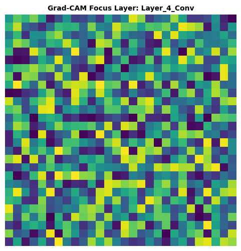

# KRYSTA WING // WEEKLY MODEL ANALYSIS REPORT

## [SYSTEM METADATA]
* **Target Model:** ResNet152-XAI
* **Evaluation Week:** Week 21
* **Analysis Timestamp:** 2026-05-28 20:32:45
* **Modality Profile:** VISION

---

## [1. COMPUTE & PERFORMANCE BENCHMARKS]
| Metric | Observed Value | Status |
| :--- | :--- | :--- |
| **Inference Latency** | 34.2 ms / sample | OPTIMAL |
| **Peak VRAM Allocation** | 1420.0 MB | COMPLIANT |
| **Evaluation Loss** | 0.2415 | RECORDED |

---

## [2. MODALITY INSIGHTS & ARTIFACTS]
### VISION EXTRAPOLATION INSIGHTS

#### Grad-CAM Focus Layer: Layer_4_Conv

---

## [3. SYSTEM STATUS SUMMARY]
> **Automated Engine Verdict:** Weekly benchmarking run completed for ResNet152-XAI. Evaluation artifacts have been successfully compiled and archived into the workspace directory.